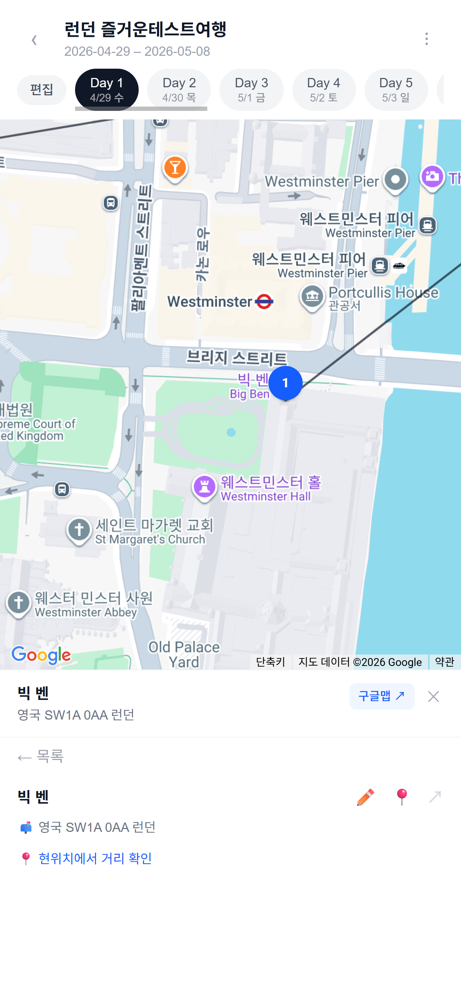
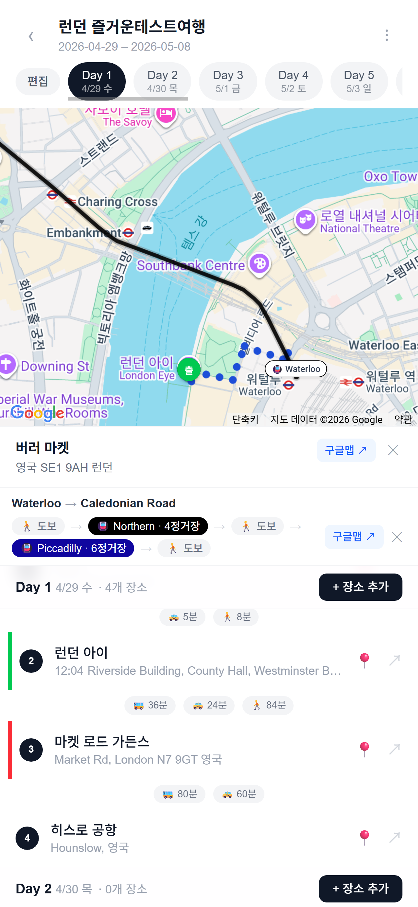
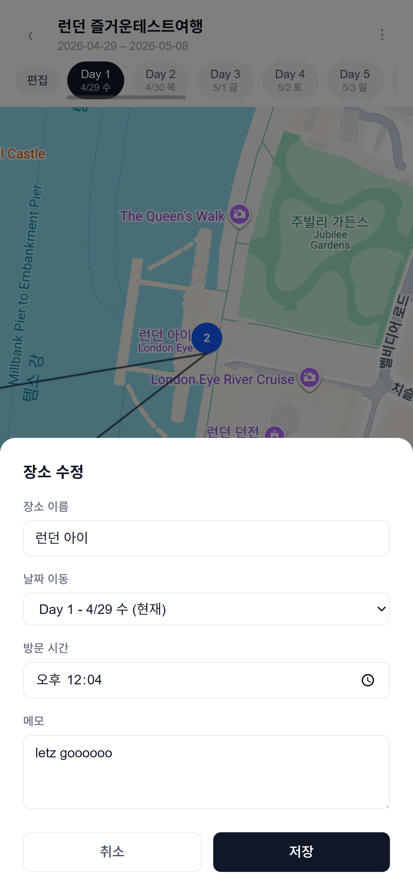

# 여행 일정

지인들과 실시간으로 함께 만드는 여행 일정 관리 앱.

<table>
  <tr>
    <td></td>
    <td></td>
    <td></td>
  </tr>
</table>

## 기술 스택

- Next.js 16 / React 19 / TypeScript
- Tailwind CSS v4
- Supabase (PostgreSQL, Auth, Realtime)
- Google Maps API (Maps, Places, Routes)
- dnd-kit (드래그 앤 드롭)
- PWA (홈화면 설치, standalone 모드)

## 주요 기능

**일정 관리**
- 여행 생성/관리 (시작일~종료일)
- Day별 장소 추가/수정/삭제, 메모
- 장소 드래그 앤 드롭 순서 변경 (편집 모드 토글)
- Day 추가/삭제, 날짜/요일 표시
- Day별 장소 전체 삭제

**지도**
- Google Maps 지도에 장소 마커 + 경로 폴리라인
- 마커 탭 시 포커스 모드 (지도 확장 + 장소 상세 카드)
- 상세 카드: 주소, 방문시간, 메모, 수정, 길찾기, 지도 보기
- POI(구글맵 기본 마커) 클릭 시 장소명/주소 카드 + 구글맵 딥링크

**이동 경로**
- 장소간 거리/소요시간 표시 (대중교통/택시/도보 3모드 동시)
- 모드 탭 시 실제 도로 경로 폴리라인 표시 (Routes API)
- 대중교통 경로 상세 표시 (노선명, 정거장 수, 환승 정보, 구간별 도보/노선 시각화)
- 현위치에서 장소까지 거리 확인 (Geolocation)
- 구글 길찾기 바로 연동

**가져오기**
- Google Takeout CSV 파일 가져오기
- 체크 → Day 선택 → 추가 반복 방식으로 Day별 분배
- Places API 좌표 자동 검색, 중복 스킵

**협업**
- Google OAuth 로그인
- 초대 링크로 멤버 추가 (헤더 쓰리닷 드롭다운 메뉴로 가져오기/초대 통합)
- Supabase Realtime 실시간 동기화

**모바일/PWA**
- PWA 지원 (홈화면 설치, 주소창 없이 사용)
- Safe Area 대응 (노치/Dynamic Island)
- 모바일 키보드 대응 (visualViewport API)
- 스켈레톤 로딩 화면 (여행 페이지 진입 시)

## 환경 변수

`.env.local` 파일에 아래 값을 설정한다.

| 변수명 | 설명 |
|---|---|
| `NEXT_PUBLIC_SUPABASE_URL` | Supabase URL |
| `NEXT_PUBLIC_SUPABASE_ANON_KEY` | Supabase Anon Key |
| `SUPABASE_SERVICE_ROLE_KEY` | Supabase Service Role Key |
| `NEXT_PUBLIC_GOOGLE_MAPS_API_KEY` | Google Maps API Key (Maps, Places) |
| `GOOGLE_MAPS_SERVER_KEY` | Google Routes API Key (서버용, 거리/경로) |

## 데이터베이스

Supabase PostgreSQL을 사용하며, RLS 정책으로 멤버만 접근 가능하다.

- **trips** -- 여행 정보
- **days** -- 여행 일자
- **places** -- 장소 (이름, 좌표, 주소, 방문시간, 메모)
- **trip_members** -- 멤버

## 스크립트

```bash
npm run dev    # 개발 서버
npm run build  # 빌드
npm run start  # 프로덕션 서버
```

## 디렉토리 구조

```
app/
  layout.tsx, page.tsx, manifest.ts, globals.css, favicon.ico
  login/page.tsx
  auth/callback/route.ts
  trip/
    [id]/
      page.tsx, loading.tsx, TripView.tsx, PlaceList.tsx
      EditPlaceModal.tsx, DistanceBadge.tsx
      import/page.tsx, ImportView.tsx
    new/page.tsx
    add/page.tsx, AddPlaceView.tsx
  invite/[token]/route.ts
  api/
    distance/route.ts
    route/route.ts
    resolve-place/route.ts
lib/supabase/client.ts, server.ts
types/supabase.ts
public/icon.svg, sw.js
```
