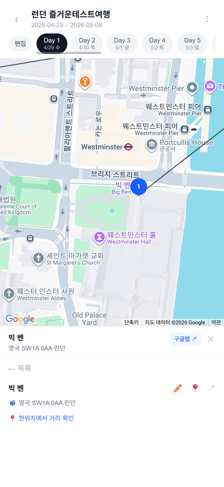
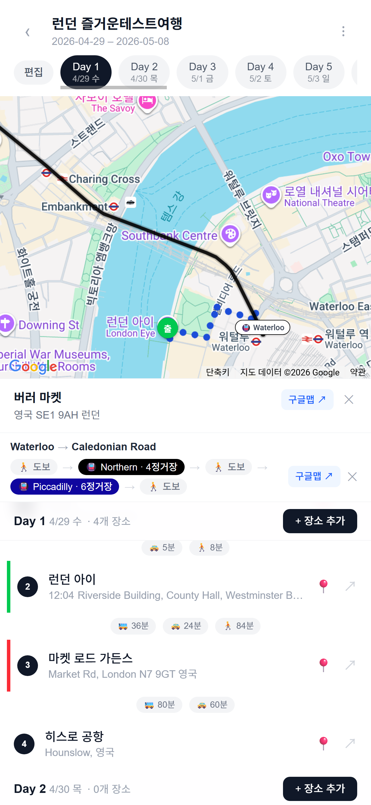
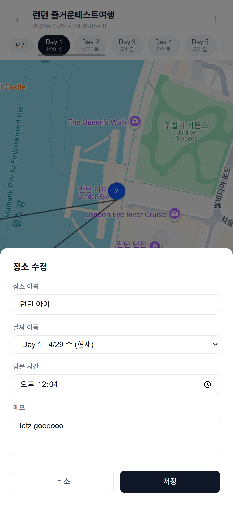

# Trip Planner

**Collaborative travel itinerary management — plan trips, share with friends, and navigate in real time.**

[](https://nextjs.org)
[](https://react.dev)
[](https://www.typescriptlang.org)
[](https://tailwindcss.com)
[](https://supabase.com)
[](https://web.dev/progressive-web-apps)

<table>
  <tr>
    <td></td>
    <td></td>
    <td></td>
  </tr>
</table>

---

## Features

- **📅 Itinerary Management** — Create trips with date ranges, add/edit/delete places per day with notes, drag-and-drop reordering, and dynamic day management.
- **🗺️ Interactive Map** — Google Maps markers with route polylines, tap-to-focus place cards showing address, visit time, and notes. Tap any POI for a quick card with a Google Maps deep link.
- **🚌 Directions** — Transit, taxi, and walking travel times shown simultaneously. Tap a mode to render the route polyline via the Routes API. Shows line names, stop counts, and transfer details. Geolocation-aware distances and a direct Google Maps directions link.
- **📥 Google Takeout Import** — Import saved places from a Google Takeout CSV, distribute them across days interactively, auto-resolve coordinates via the Places API, and skip duplicates.
- **🤝 Real-time Collaboration** — Google OAuth, shareable invite links, and live sync powered by Supabase Realtime. All itinerary changes propagate instantly to every member.
- **📱 Mobile / PWA** — Installable as a PWA (home screen, standalone mode). Handles safe areas (notch / Dynamic Island), `visualViewport` keyboard shifts, and skeleton loading screens.
- **🌐 Korean / English** — The whole UI is localized with `next-intl`. A one-tap switcher writes a `NEXT_LOCALE` cookie and refreshes; Korean is the default.

---

## Getting Started

### Prerequisites

- Node.js 20+
- A [Supabase](https://supabase.com) project
- A [Google Cloud](https://console.cloud.google.com) project with the following APIs enabled:
  - **Maps JavaScript API** — map rendering and the place-search autocomplete widget (browser key)
  - **Places API** — `place/details/json` and `place/findplacefromtext/json`, used by the Takeout import to resolve coordinates (server key); also backs the `google.maps.places.Autocomplete` widget. These are Google's **legacy** Places endpoints, superseded by Places API (New), so a brand-new Cloud project may need the legacy API switched on explicitly.
  - **Routes API** — `computeRouteMatrix` for travel times and `computeRoutes` for route polylines (server key)

### Installation

```bash
git clone https://github.com/knulps/trip.git
cd trip
npm install
```

### Setup

1. Copy the example environment file and fill in your credentials:

   ```bash
   cp .env.local.example .env.local
   ```

2. Apply the database schema from `supabase/schema.sql` in your Supabase SQL editor — the file is re-runnable, so the same script works for a new project and for an upgrade (see [Database](#database)).

3. Start the development server:

   ```bash
   npm run dev
   ```

   Open [http://localhost:3000](http://localhost:3000).

---

## Configuration

All configuration is done via environment variables.

| Variable | Description |
|---|---|
| `NEXT_PUBLIC_SUPABASE_URL` | Your Supabase project URL |
| `NEXT_PUBLIC_SUPABASE_ANON_KEY` | Supabase anonymous (public) key |
| `SUPABASE_SERVICE_ROLE_KEY` | Supabase service role key (server-side only) |
| `NEXT_PUBLIC_GOOGLE_MAPS_API_KEY` | Google Maps browser key — Maps JavaScript API + Places (client-side) |
| `GOOGLE_MAPS_SERVER_KEY` | Google Maps server key — Routes API **and** the legacy Places endpoints (server-side only) |

Restricting the server key to the Routes API alone is a common mistake: `/api/resolve-place` calls the legacy Places endpoints with the same key, so the Takeout import's coordinate lookup fails quietly. See `.env.local.example` for the exact restriction list.

---

## Database

Hosted on Supabase (PostgreSQL). Row-Level Security (RLS) restricts all data access to trip members only.

| Table | Purpose |
|---|---|
| `trips` | Trip metadata (name, start/end dates, creator, invite token) |
| `days` | Individual days belonging to a trip |
| `places` | Places per day (name, coordinates, address, visit time, memo, ordering key) |
| `trip_members` | Members of each trip (used for RLS and invite management) |

`supabase/schema.sql` covers both a fresh project and an existing one, and **is safe to re-run**: tables and indexes use `create ... if not exists`, added columns use `alter table ... add column if not exists`, policies are dropped before being recreated, helper functions use `create or replace`, and the Realtime publication skips tables that are already registered.

Two things are worth knowing when provisioning from scratch:

- **RLS recursion.** A policy on `trip_members` that subqueries `trip_members` makes Postgres re-apply the same policy to the subquery, and the statement dies with `infinite recursion detected in policy for relation` (42P17). Membership checks therefore live in `security definer` helper functions — `is_trip_member()` and `is_trip_creator()` — with a pinned `search_path`, executable by the `authenticated` role only.
- **`INSERT ... RETURNING` is checked against the SELECT policy.** The app creates a trip with `.insert({...}).select('id')`, which PostgREST sends as `INSERT ... RETURNING`. PostgreSQL requires every row handed to `RETURNING` to satisfy the table's SELECT policies and throws an error (`42501`) when one does not — such rows are never silently omitted. At that instant the creator's `trip_members` row does not exist yet (it is inserted by the next statement), so a members-only `trips_select` would make trip creation fail outright. `trips_select` therefore also admits the creator (`created_by = auth.uid() or is_trip_member(id)`), which matches `trips_update` / `trips_delete` and widens nothing beyond the user's own row. The `trip_members` INSERT policy then lets a user insert only their own membership (`user_id = auth.uid()`) into a trip they created; joining through an invite link is handled by `/invite/[token]`, which runs with the service role, so the policy does not need to be any wider. The matching DELETE policy (`trip_members_delete`) lets a user remove only their own membership — leaving a trip — and excludes the creator, because `trips_update` / `trips_delete` are gated on `created_by = auth.uid()` and a creator who left would leave the trip editable by nobody.

Realtime is enabled on `days` and `places`.

---

## Project Structure

```
app/
├── layout.tsx                  # Root layout, fonts, next-intl provider, PWA meta
├── page.tsx                    # Home / trip list
├── globals.css                 # Tailwind base styles
├── manifest.ts                 # PWA manifest
├── login/                      # Google OAuth login page
├── auth/callback/              # OAuth callback handler
├── trip/
│   ├── new/                    # Create new trip
│   ├── add/                    # Add places flow (Places Autocomplete)
│   └── [id]/
│       ├── TripView.tsx        # Main trip view (map + list)
│       ├── PlaceList.tsx       # Day-by-day place list with DnD
│       ├── EditPlaceModal.tsx  # Edit place details
│       ├── DistanceBadge.tsx   # Transit/taxi/walk distance badge
│       ├── loading.tsx         # Skeleton shown while the trip view loads
│       └── import/             # Google Takeout CSV import UI (+ its own loading.tsx)
├── invite/[token]/             # Invite link handler
└── api/                        # Every route below requires a signed-in session (401 otherwise)
    ├── distance/               # Travel times — Routes API computeRouteMatrix
    ├── route/                  # Polyline for a travel mode — Routes API computeRoutes
    └── resolve-place/          # Place → coordinates (legacy Places API)

lib/
├── api-auth.ts                 # requireUser() session guard + JSON body / lat-lng validation
└── supabase/
    ├── client.ts               # Browser Supabase client
    └── server.ts               # Server Supabase client (cookies) + service-role client

components/
└── LocaleSwitcher.tsx          # Korean / English toggle (NEXT_LOCALE cookie)

i18n/
└── request.ts                  # next-intl request config — reads the locale cookie
messages/
├── ko.json                     # Korean UI strings
└── en.json                     # English UI strings

types/
└── supabase.ts                 # Generated Supabase types

supabase/
└── schema.sql                  # Tables, RLS policies, Realtime setup (re-runnable)

public/
├── icon.svg                    # App icon
└── sw.js                       # Service worker (PWA)

proxy.ts                        # Supabase session refresh + /trip route protection.
                                # Next.js 16 deprecated the `middleware` file convention
                                # in favour of `proxy`, which always runs on Node.js.
```

---

## Scripts

```bash
npm run dev      # Start development server (http://localhost:3000)
npm run build    # Production build
npm run start    # Start production server
npm run lint     # ESLint (eslint-config-next)
```

---

## Tech Stack

| Layer | Technology |
|---|---|
| Framework | [Next.js 16](https://nextjs.org) (App Router) |
| UI | [React 19](https://react.dev) + [TypeScript](https://www.typescriptlang.org) |
| Styling | [Tailwind CSS v4](https://tailwindcss.com) |
| Database / Auth | [Supabase](https://supabase.com) (PostgreSQL + Auth + Realtime) |
| Maps | [Google Maps Platform](https://developers.google.com/maps) (Maps JS, Places, Routes) via [`@vis.gl/react-google-maps`](https://visgl.github.io/react-google-maps/) |
| i18n | [next-intl](https://next-intl.dev) (Korean / English, cookie-based) |
| Drag & Drop | [dnd-kit](https://dndkit.com) |
| PWA | Service Worker + Web App Manifest |

---

## License

MIT
